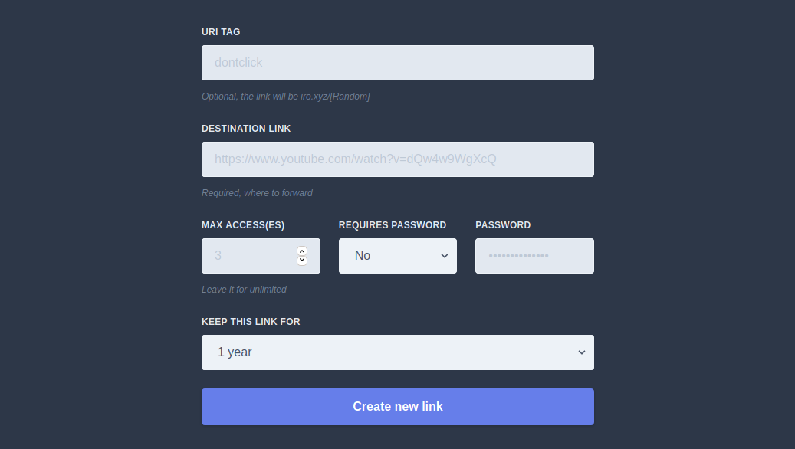

<!-- PROJECT LOGO -->
<br />
<p align="center">
  <a href="https://github.com/othneildrew/Best-README-Template">
    
  </a>

  <h3 align="center">Launchpad</h3>

  <p align="center">
    A simple link shortener with self-destruction and encryption
    <br />
    <a href="https://iro.xyz">Give it a try!</a>
  </p>
</p>


<!-- TABLE OF CONTENTS -->
## Table of Contents

* [About the Project](#about-the-project)
  * [Built With](#built-with)
* [Getting Started](#getting-started)
  * [Prerequisites](#prerequisites)
  * [Installation](#installation)
* [Contributing](#contributing)
* [License](#license)
* [Contact](#contact)
* [Acknowledgements](#acknowledgements)


<!-- ABOUT THE PROJECT -->
## About The Project

<p align="center">
  
</p>

I just wanted to make a simple link shortener, but it was too ordinary if it only just had a random URL. However, I thought and implemented more features that other link shorteners don't have, and I like it.

Here's why:
* Easy to use - Paste a link and you are good to go
* Max access - You can set X for this: "After X clicks the link will self destruct"
* Encrypting /w password - The link you entered will be encrypted with your password

A list of commonly used resources that I find helpful are listed in the acknowledgements.

### Built With
* [MongoDB](https://www.mongodb.com) and [Mongoose](https://mongoosejs.com)
* [Express](https://expressjs.com)
* [Tailwind CSS](https://tailwindcss.com) via CDN
* [Node.js](https://nodejs.org)

So it's METN? :confused:

<!-- GETTING STARTED -->
## Getting Started

To get a local copy up and running follow these simple example steps.

### Prerequisites

You will need MongoDB and reCaptcha keys for this project.

I will assume that you already have a MongoDB server running and have URI for it.

### Installation

1. Get a reCaptcha API Key at [https://google.com/recaptcha](https://google.com/recaptcha)
2. Clone the repo and change directory
```sh
git clone https://github.com/hw4n/launchpad.git
cd launchpad
```
3. Install NPM packages
```sh
npm install
```
4. Create file `.env` and enter environment variables
```sh
touch .env
```

```
PORT = Port-you-want (defaults to 8080)
DBURI = mongodb+srv://....
RECAPTCHA_SECRET = Put-secret-here
RECAPTCHA_SITEKEY = Put-site-key-here
```
5. Compile it and run it
```sh
tsc

node build/index.js
```


<!-- CONTRIBUTING -->
## Contributing

Contributions are what make the open source community such an amazing place to be learn, inspire, and create. Any contributions you make are **greatly appreciated**.

1. Fork the Project
2. Create your Feature Branch (`git checkout -b feature/AmazingFeature`)
3. Commit your Changes (`git commit -m 'Add some AmazingFeature'`)
4. Push to the Branch (`git push origin feature/AmazingFeature`)
5. Open a Pull Request


<!-- LICENSE -->
## License

Distributed under the MIT License. See `LICENSE` for more information.


<!-- CONTACT -->
## Contact

Hwanhee Chae - hh@hwan.me

Project Link: [https://github.com/hw4n/launchpad](https://github.com/hw4n/launchpad)


<!-- ACKNOWLEDGEMENTS -->
## Acknowledgements
* [Best-README-Template](https://github.com/othneildrew/Best-README-Template)
* [Complete list of github markdown emoji markup](https://gist.github.com/rxaviers/7360908#file-gistfile1-md)
* [iconmonstr - Free simple icons for your next project](https://iconmonstr.com/)
* [axios](https://github.com/axios/axios)
* [dotenv](https://github.com/motdotla/dotenv)
* [bcrypt](https://github.com/kelektiv/node.bcrypt.js)
* [ejs](https://github.com/mde/ejs)
* [nodemon](http://nodemon.io)
* [rand-token](https://github.com/sehrope/node-rand-token)


<!-- MARKDOWN LINKS & IMAGES -->
<!-- https://www.markdownguide.org/basic-syntax/#reference-style-links -->
[product-screenshot]: images/screenshot.png